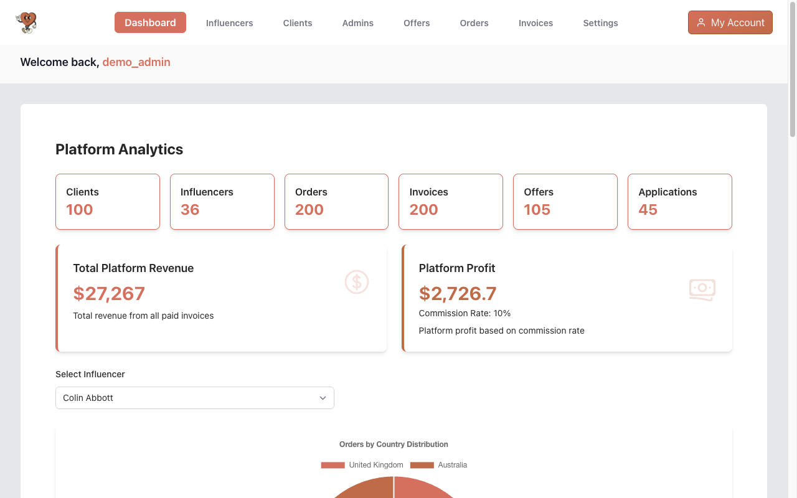
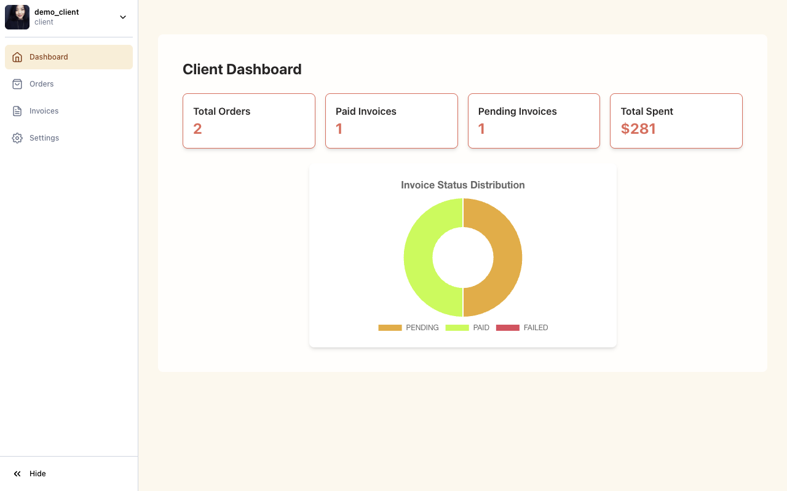

# LikeMe

A marketplace where clients buy social media exposure (likes, comments, follows, shout-outs) directly from influencers, with an admin team vetting who gets to sell.

I built it alone in my third semester of ICT & Software Engineering at Fontys University of Applied Sciences, between September 2024 and January 2025. This repository is the archived version, merged from the original separate frontend and backend repositories into one monorepo that boots with a single command and comes with seeded demo data.

Write-up: [I made things work. Then I learned to make them last.](https://nb.nb-limited.com/writing/likeme), on why it's built this way and how it got there.

| | |
|---|---|
|  |  |
|  |  |

## Run it

You need Docker with Compose.

```bash
cp .env.example .env
# Fill in MYSQL_ROOT_PASSWORD, MYSQL_PASSWORD and JWT_SECRET.
# openssl rand -base64 48 gives you a suitable value for each.
docker compose up -d --build
```

The first build takes a few minutes. When it settles:

| What | Where |
|---|---|
| Web app | http://localhost:3000 (or the `WEB_PORT` you set) |
| API | http://localhost:8080/api |
| API docs (Swagger) | http://localhost:8080/api/docs/swagger |

A one-shot `seed` container fills the database with around 100 clients, 35 influencers, 200 orders and their invoices. It is safe to run again; it skips anything already present. Avatars are loaded from [randomuser.me](https://randomuser.me) and cover images from [Unsplash](https://unsplash.com), so the browser needs internet access to show them.

### Demo accounts

| Role | Username | Password |
|---|---|---|
| Admin | `demo_admin` | `demo1234` |
| Client | `demo_client` | `demo1234` |
| Influencer | `demo_influencer` | `demo1234` |

Change the shared password with `DEMO_PASSWORD` in `.env` before the first boot.

### Influencer onboarding without email

Influencers don't sign up directly. They apply, an admin approves the application, and the approval email carries a link to set a password. With no `SENDGRID_API_KEY` configured, that email is written to the API log instead, so the whole flow works offline:

```bash
docker compose logs api | grep "approval email"
```

Open the link, choose a password, and you are signed in as the new influencer.

## What it does

- **Clients** browse influencers, buy offers, track orders and pay invoices.
- **Influencers** apply to join, publish offers, fulfil orders and follow their earnings.
- **Admins** review applications, manage every account, offer and order, and see platform revenue and the commission it earns.
- Clients hear when an order completes and influencers when an invoice is paid, live over WebSockets.

## How it's built

```
apps/
  api/    Spring Boot 3.5, Java 21, Spring Security with JWT, JPA, Flyway, STOMP over WebSocket
  web/    Next.js 14 (App Router), React 18, TanStack Query, react-hook-form + zod, Tailwind, Chart.js
  seed/   Python script that generates the demo data with Faker
docs/
  architecture/  C4 model (Structurizr DSL) and a PlantUML code diagram
```

The API follows a layered structure: controllers, a business layer with services and validators, and repositories. MySQL 8.4 holds the data, with the schema managed by Flyway migrations. The backend's tests need JDK 21, and its integration tests need a real MySQL. Give them a throwaway one rather than the demo database:

```bash
docker run --rm -d --name likeme-test-db -p 3307:3306 \
  -e MYSQL_ROOT_PASSWORD=root -e MYSQL_DATABASE=likeme \
  -e MYSQL_USER=likeme_mod -e MYSQL_PASSWORD=likeme mysql:8.4
cd apps/api && SPRING_DATASOURCE_URL=jdbc:mysql://localhost:3307/likeme ./gradlew test
```

The Cypress end-to-end specs run against a booted stack:

```bash
cd apps/web && npm ci && CYPRESS_baseUrl=http://localhost:3000 npx cypress run
```

## Known issues

These are carried over from the original project and left as they were:

- Unauthenticated `401` responses lack CORS headers, because the CORS filter runs after Spring Security. The browser reports them as CORS errors in the console.
- The frontend checks token expiry against a longer window than the backend's 15-minute access token, so it refreshes more often than it needs to.
- Submitting an influencer application without billing details returns `500` instead of a validation error.

## Status

Archived. The stack is pinned at the final patch of each line it was built on (Spring Boot 3.5.16, Java 21, Next.js 14.2.35, Node 24, MySQL 8.4), and some of those lines are out of upstream support. It is meant to be read and run locally, not deployed. See [SECURITY.md](SECURITY.md) for the details.

## License

Source-available under the [PolyForm Noncommercial License 1.0.0](LICENSE). You may read, run, modify and share it for any noncommercial purpose, as long as the copyright notice comes along.

This repository is a showcase, so it doesn't take issues or pull requests. Forks are welcome under the license. Commercial use needs a separate paid license; contact [NB Limited](https://nb-limited.com).
